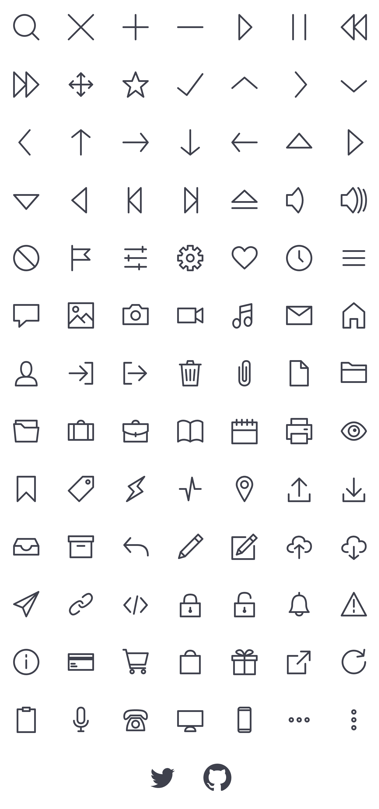
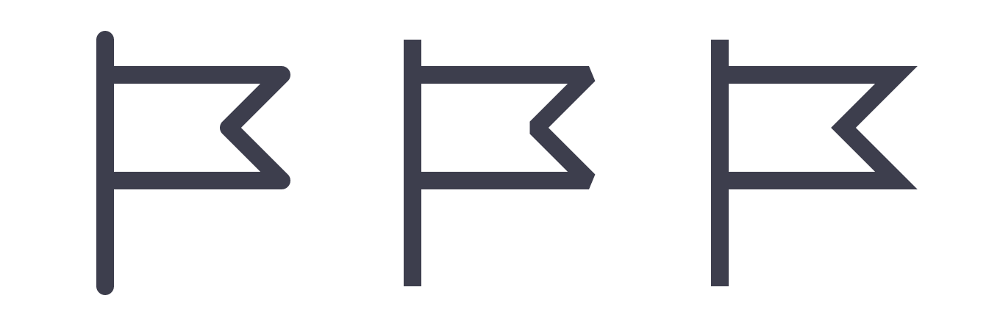
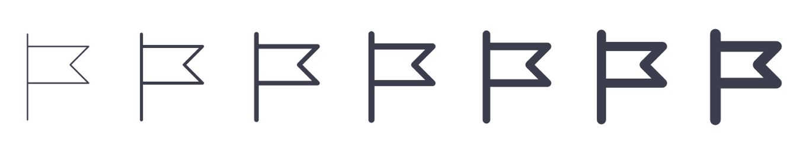

# Bytesize Icons
### A tiny style-controlled SVG iconset

Each icon is hand-coded along a 32x32 grid, and uses SVG stroke allowing for maximum style flexibility; meaning you can adjust the weight, color, size, and if you want the edges to be round or square. [See demo](http://danklammer.com/articles/svg-stroke-ftw/#give-it-a-spin).

All 84 icons weigh in at 9.4kb minified (2.6kb in SVGZ).




## Usage

Either drop each icon inline directly in your page as-needed, or loaded them up via external `.svg` file and the `use` tag. ([Learn more about using an external SVG reference.](https://css-tricks.com/svg-use-with-external-reference-take-2/)).

You can then easily change the weight of the icon by changing `stroke-width` attribute. You can also change the shape of the line caps and the line joins with `stroke-linecap` and `stroke-linejoin`. This will change the style of the icons by making them rounded or squared off. All these stroke properties are also available to use in CSS.


### Recommended Styles



Style  | stroke-linejoin | stroke-linecap
-------|-----------------|----------------
Round  | round           | round
Bevel  | bevel           | butt
Miter  | miter           | butt

### Recommended Weights



Weight        | stroke-width (px) | stroke-width (%) 
--------------|-------------------|----------------
Ultra Light   | 0.5px             | 1.5625%
Thin          | 1px               | 3.125%
Light         | 1.5px             | 4.6875%
Regular       | 2px               | 6.25%
Medium        | 2.5px             | 7.8125%
Bold          | 3px               | 9.375%
Heavy         | 3.5px             | 10.9375%


### Examples

- [Inline SVG (64px, 32px, 24px)](https://cdn.rawgit.com/danklammer/bytesize-icons/master/examples/bytesize-inline.html)
- [SVG Symbols and the Use tag (64px, 32px, 24px)](https://cdn.rawgit.com/danklammer/bytesize-icons/master/examples/bytesize-symbols.html)
- [All Styles and Weights](https://cdn.rawgit.com/danklammer/bytesize-icons/master/examples/bytesize-styles.html)


### Limitations

Since there is a 2px margin between the paths and `viewBox`, I recommend not having a `stroke-width` larger than **4px** (or **12.5%**). 4px might seems small but it's relative to the 32x32 grid.

Make sure you use `stroke-width` in increments of **0.5px** or **1.5625%**, along with size (height/width) increments of **24px**, **32px**, **48px**, **64px**. This allows for optimal pixel-hinting.

If you decide to use a larger `stroke-width` with `stroke-linejoin: miter` (Squared off style), I recommend using `overflow: visible` just in case the linecap edge falls just outside the `viewBox`. This prevents any of the points of the icon from getting cut off.


## Design Files

- [Bytesize .iconjar Set](https://github.com/danklammer/bytesize-icons/blob/master/design/bytesize-iconjar.zip?raw=true)

## Forks & Extensions
- [Bytesize Icons as React Components](https://github.com/abdelhai/react-bytesize-icons) by [Mustafa Abdelhai](https://github.com/abdelhai/)
- [Yet Another Bytesize Icons as React Component](https://github.com/rhysd/react-component-bytesize-icons) by [@rhysd](https://github.com/rhysd)
- [Bytesize Icons as Custom Elements](https://github.com/rhysd/bytesize-icon-elements) by [@rhysd](https://github.com/rhysd)

## File Size

13 KB   | 9.4 KB   | 2.6 KB
--------|----------|-------
Raw     | Minified | SVGZ


## Grab-n-Go

 | **Search**
---|---


```html
<svg id="i-search" viewBox="0 0 32 32" width="32" height="32" fill="none" stroke="currentcolor" stroke-linecap="round" stroke-linejoin="round" stroke-width="2">
    <circle cx="14" cy="14" r="12" />
    <path d="M23 23 L30 30"  />
</svg>
```

---

 | **Close**
---|---


```html
<svg id="i-close" viewBox="0 0 32 32" width="32" height="32" fill="none" stroke="currentcolor" stroke-linecap="round" stroke-linejoin="round" stroke-width="2">
    <path d="M2 30 L30 2 M30 30 L2 2" />
</svg>
```

---

 | **Plus**
---|---


```html
<svg id="i-plus" viewBox="0 0 32 32" width="32" height="32" fill="none" stroke="currentcolor" stroke-linecap="round" stroke-linejoin="round" stroke-width="2">
    <path d="M16 2 L16 30 M2 16 L30 16" />
</svg>
```

---

 | **Minus**
---|---


```html
<svg id="i-minus" viewBox="0 0 32 32" width="32" height="32" fill="none" stroke="currentcolor" stroke-linecap="round" stroke-linejoin="round" stroke-width="2">
    <path d="M2 16 L30 16" />
</svg>
```

---

 | **Play**
---|---


```html
<svg id="i-play" viewBox="0 0 32 32" width="32" height="32" fill="none" stroke="currentcolor" stroke-linecap="round" stroke-linejoin="round" stroke-width="2">
    <path d="M10 2 L10 30 24 16 Z" />
</svg>
```

---

 | **Pause**
---|---


```html
<svg id="i-pause" viewBox="0 0 32 32" width="32" height="32" fill="none" stroke="currentcolor" stroke-linecap="round" stroke-linejoin="round" stroke-width="2">
    <path d="M23 2 L23 30 M9 2 L9 30" />
</svg>
```

---

 | **Backwards**
---|---


```html
<svg id="i-backwards" viewBox="0 0 32 32" width="32" height="32" fill="none" stroke="currentcolor" stroke-linecap="round" stroke-linejoin="round" stroke-width="2">
    <path d="M16 2 L2 16 16 30 16 16 30 30 30 2 16 16 Z" />
</svg>
```

---

 | **Forwards**
---|---


```html
<svg id="i-forwards" viewBox="0 0 32 32" width="32" height="32" fill="none" stroke="currentcolor" stroke-linecap="round" stroke-linejoin="round" stroke-width="2">
    <path d="M16 2 L30 16 16 30 16 16 2 30 2 2 16 16 Z" /> 
</svg>
```

---

 | **Star**
---|---


```html
<svg id="i-star" viewBox="0 0 32 32" width="32" height="32" fill="none" stroke="currentcolor" stroke-linecap="round" stroke-linejoin="round" stroke-width="2">
    <path d="M16 2 L20 12 30 12 22 19 25 30 16 23 7 30 10 19 2 12 12 12 Z" />
</svg>
```

---

 | **Checkmark**
---|---


```html
<svg id="i-checkmark" viewBox="0 0 32 32" width="32" height="32" fill="none" stroke="currentcolor" stroke-linecap="round" stroke-linejoin="round" stroke-width="2">
    <path d="M2 20 L12 28 30 4" />
</svg>
```

---

 | **Chevron Top**
---|---


```html
<svg id="i-chevron-top" viewBox="0 0 32 32" width="32" height="32" fill="none" stroke="currentcolor" stroke-linecap="round" stroke-linejoin="round" stroke-width="2">
    <path d="M30 20 L16 8 2 20" />
</svg>
```

---

 | **Chevron Right**
---|---


```html
<svg id="i-chevron-right" viewBox="0 0 32 32" width="32" height="32" fill="none" stroke="currentcolor" stroke-linecap="round" stroke-linejoin="round" stroke-width="2">
    <path d="M12 30 L24 16 12 2" />
</svg>
```

---

 | **Chevron Bottom**
---|---


```html
<svg id="i-chevron-bottom" viewBox="0 0 32 32" width="32" height="32" fill="none" stroke="currentcolor" stroke-linecap="round" stroke-linejoin="round" stroke-width="2">
    <path d="M30 12 L16 24 2 12" />
</svg>
```

---

 | **Chevron Left**
---|---


```html
<svg id="i-chevron-left" viewBox="0 0 32 32" width="32" height="32" fill="none" stroke="currentcolor" stroke-linecap="round" stroke-linejoin="round" stroke-width="2">
    <path d="M20 30 L8 16 20 2" />
</svg>
```

---

 | **Arrow Top**
---|---


```html
<svg id="i-arrow-top" viewBox="0 0 32 32" width="32" height="32" fill="none" stroke="currentcolor" stroke-linecap="round" stroke-linejoin="round" stroke-width="2">
    <path d="M6 10 L16 2 26 10 M16 2 L16 30" />
</svg>
```

---

 | **Arrow Right**
---|---


```html
<svg id="i-arrow-right" viewBox="0 0 32 32" width="32" height="32" fill="none" stroke="currentcolor" stroke-linecap="round" stroke-linejoin="round" stroke-width="2">
    <path d="M22 6 L30 16 22 26 M30 16 L2 16" />
</svg>
```

---

 | **Arrow Bottom**
---|---


```html
<svg id="i-arrow-bottom" viewBox="0 0 32 32" width="32" height="32" fill="none" stroke="currentcolor" stroke-linecap="round" stroke-linejoin="round" stroke-width="2">
    <path d="M6 22 L16 30 26 22 M16 30 L16 2" />
</svg>
```

---

 | **Arrow Left**
---|---


```html
<svg id="i-arrow-left" viewBox="0 0 32 32" width="32" height="32" fill="none" stroke="currentcolor" stroke-linecap="round" stroke-linejoin="round" stroke-width="2">
    <path d="M10 6 L2 16 10 26 M2 16 L30 16" />
</svg>
```

---

 | **Caret Top**
---|---


```html
<svg id="i-caret-top" viewBox="0 0 32 32" width="32" height="32" fill="none" stroke="currentcolor" stroke-linecap="round" stroke-linejoin="round" stroke-width="2">
    <path d="M30 22 L16 6 2 22 Z" />
</svg>
```

---

 | **Caret Right**
---|---


```html
<svg id="i-caret-right" viewBox="0 0 32 32" width="32" height="32" fill="none" stroke="currentcolor" stroke-linecap="round" stroke-linejoin="round" stroke-width="2">
    <path d="M10 30 L26 16 10 2 Z" />
</svg>
```

---

 | **Caret Bottom**
---|---


```html
<svg id="i-caret-bottom" viewBox="0 0 32 32" width="32" height="32" fill="none" stroke="currentcolor" stroke-linecap="round" stroke-linejoin="round" stroke-width="2">
    <path d="M30 10 L16 26 2 10 Z" />
</svg>
```

---

 | **Caret Left**
---|---


```html
<svg id="i-caret-left" viewBox="0 0 32 32" width="32" height="32" fill="none" stroke="currentcolor" stroke-linecap="round" stroke-linejoin="round" stroke-width="2">
    <path d="M22 30 L6 16 22 2 Z" />
</svg>
```

---

 | **Start**
---|---


```html
<svg id="i-start" viewBox="0 0 32 32" width="32" height="32" fill="none" stroke="currentcolor" stroke-linecap="round" stroke-linejoin="round" stroke-width="2">
    <path d="M8 2 L8 16 22 2 22 30 8 16 8 30" />
</svg>
```

---

 | **End**
---|---


```html
<svg id="i-end" viewBox="0 0 32 32" width="32" height="32" fill="none" stroke="currentcolor" stroke-linecap="round" stroke-linejoin="round" stroke-width="2">
    <path d="M24 2 L24 16 10 2 10 30 24 16 24 30" />
</svg>
```

---

 | **Eject**
---|---


```html
<svg id="i-eject" viewBox="0 0 32 32" width="32" height="32" fill="none" stroke="currentcolor" stroke-linecap="round" stroke-linejoin="round" stroke-width="2">
    <path d="M30 18 L16 5 2 18Z M2 25 L30 25" />
</svg>
```

---

 | **Mute**
---|---


```html
<svg id="i-mute" viewBox="0 0 32 32" width="32" height="32" fill="none" stroke="currentcolor" stroke-linecap="round" stroke-linejoin="round" stroke-width="2">
    <path d="M20 16 C20 8 15 2 15 2 L8 10 2 10 2 22 8 22 15 30 C15 30 20 24 20 16 Z" />
</svg>
```

---

 | **Volume**
---|---


```html
<svg id="i-volume" viewBox="0 0 32 32" width="32" height="32" fill="none" stroke="currentcolor" stroke-linecap="round" stroke-linejoin="round" stroke-width="2">
    <path d="M20 16 C20 8 15 2 15 2 L8 10 2 10 2 22 8 22 15 30 C15 30 20 24 20 16 Z M21 2 C21 2 25 6 25 16 25 26 21 30 21 30 M27 4 C27 4 30 8 30 16 30 24 27 28 27 28" />
</svg>
```

---

 | **Ban**
---|---


```html
<svg id="i-ban" viewBox="0 0 32 32" width="32" height="32" fill="none" stroke="currentcolor" stroke-linecap="round" stroke-linejoin="round" stroke-width="2">
    <circle cx="16" cy="16" r="14" />
    <path d="M6 6 L26 26" />
</svg>
```

---

 | **Flag**
---|---


```html
<svg id="i-flag" viewBox="0 0 32 32" width="32" height="32" fill="none" stroke="currentcolor" stroke-linecap="round" stroke-linejoin="round" stroke-width="2">
    <path d="M6 2 L6 30 M6 6 L26 6 20 12 26 18 6 18" />
</svg>
```

---

 | **Options**
---|---


```html
<svg id="i-options" viewBox="0 0 32 32" width="32" height="32" fill="none" stroke="currentcolor" stroke-linecap="round" stroke-linejoin="round" stroke-width="2">
    <path d="M28 6 L4 6 M28 16 L4 16 M28 26 L4 26 M24 3 L24 9 M8 13 L8 19 M20 23 L20 29" />
</svg>
```

---

 | **Settings**
---|---


```html
<svg id="i-settings" viewBox="0 0 32 32" width="32" height="32" fill="none" stroke="currentcolor" stroke-linecap="round" stroke-linejoin="round" stroke-width="2">
    <path d="M13 2 L13 6 11 7 8 4 4 8 7 11 6 13 2 13 2 19 6 19 7 21 4 24 8 28 11 25 13 26 13 30 19 30 19 26 21 25 24 28 28 24 25 21 26 19 30 19 30 13 26 13 25 11 28 8 24 4 21 7 19 6 19 2 Z" />
    <circle cx="16" cy="16" r="4" />
</svg>
```

---

 | **Heart**
---|---


```html
<svg id="i-heart" viewBox="0 0 32 32" width="32" height="32" fill="none" stroke="currentcolor" stroke-linecap="round" stroke-linejoin="round" stroke-width="2">
    <path d="M4 16 C1 12 2 6 7 4 12 2 15 6 16 8 17 6 21 2 26 4 31 6 31 12 28 16 25 20 16 28 16 28 16 28 7 20 4 16 Z" />
</svg>
```

---

 | **Clock**
---|---


```html
<svg id="i-clock" viewBox="0 0 32 32" width="32" height="32" fill="none" stroke="currentcolor" stroke-linecap="round" stroke-linejoin="round" stroke-width="2">
    <circle cx="16" cy="16" r="14" />
    <path d="M16 8 L16 16 20 20" />
</svg>
```

---

 | **Menu**
---|---


```html
<svg id="i-menu" viewBox="0 0 32 32" width="32" height="32" fill="none" stroke="currentcolor" stroke-linecap="round" stroke-linejoin="round" stroke-width="2">
    <path d="M4 8 L28 8 M4 16 L28 16 M4 24 L28 24" />
</svg>
```

---

 | **Message**
---|---


```html
<svg id="i-msg" viewBox="0 0 32 32" width="32" height="32" fill="none" stroke="currentcolor" stroke-linecap="round" stroke-linejoin="round" stroke-width="2">
    <path d="M2 4 L30 4 30 22 16 22 8 29 8 22 2 22 Z" />
</svg>
```

---

 | **Photo**
---|---


```html
<svg id="i-photo" viewBox="0 0 32 32" width="32" height="32" fill="none" stroke="currentcolor" stroke-linecap="round" stroke-linejoin="round" stroke-width="2">
    <path d="M20 24 L12 16 2 26 2 2 30 2 30 24 M16 20 L22 14 30 22 30 30 2 30 2 24" />
    <circle cx="10" cy="9" r="3" />
</svg>
```

---

 | **Camera**
---|---


```html
<svg id="i-camera" viewBox="0 0 32 32" width="32" height="32" fill="none" stroke="currentcolor" stroke-linecap="round" stroke-linejoin="round" stroke-width="2">
    <path d="M2 8 L 9 8 12 4 20 4 23 8 30 8 30 26 2 26 Z" />
    <circle cx="16" cy="16" r="5" />
</svg>
```

---

 | **Video**
---|---


```html
<svg id="i-video" viewBox="0 0 32 32" width="32" height="32" fill="none" stroke="currentcolor" stroke-linecap="round" stroke-linejoin="round" stroke-width="2">
    <path d="M22 13 L30 8 30 24 22 19 Z M2 8 L2 24 22 24 22 8 Z" />
</svg>
```

---

 | **Music**
---|---


```html
<svg id="i-music" viewBox="0 0 32 32" width="32" height="32" fill="none" stroke="currentcolor" stroke-linecap="round" stroke-linejoin="round" stroke-width="2">
    <path d="M11 25 L11 6 24 3 24 23 M11 13 L24 10" />
    <ellipse cx="7" cy="25" rx="4" ry="5" />
    <ellipse cx="20" cy="23" rx="4" ry="5" />
</svg>
```

---

 | **Mail**
---|---


```html
<svg id="i-mail" viewBox="0 0 32 32" width="32" height="32" fill="none" stroke="currentcolor" stroke-linecap="round" stroke-linejoin="round" stroke-width="2">
    <path d="M2 26 L30 26 30 6 2 6 Z M2 6 L16 16 30 6" />
</svg>
```

---

 | **Home**
---|---


```html
<svg id="i-home" viewBox="0 0 32 32" width="32" height="32" fill="none" stroke="currentcolor" stroke-linecap="round" stroke-linejoin="round" stroke-width="2">
    <path d="M12 20 L12 30 4 30 4 12 16 2 28 12 28 30 20 30 20 20 Z" />
</svg>
```

---

 | **User**
---|---


```html
<svg id="i-user" viewBox="0 0 32 32" width="32" height="32" fill="none" stroke="currentcolor" stroke-linecap="round" stroke-linejoin="round" stroke-width="2">
    <path d="M22 11 C22 16 19 20 16 20 13 20 10 16 10 11 10 6 12 3 16 3 20 3 22 6 22 11 Z M4 30 L28 30 C28 21 22 20 16 20 10 20 4 21 4 30 Z" />
</svg>
```

---

 | **Trash**
---|---


```html
<svg id="i-trash" viewBox="0 0 32 32" width="32" height="32" fill="none" stroke="currentcolor" stroke-linecap="round" stroke-linejoin="round" stroke-width="2">
    <path d="M28 6 L6 6 8 30 24 30 26 6 4 6 M16 12 L16 24 M21 12 L20 24 M11 12 L12 24 M12 6 L13 2 19 2 20 6" />
</svg>
```

---

 | **Paperclip**
---|---


```html
<svg id="i-paperclip" viewBox="0 0 32 32" width="32" height="32" fill="none" stroke="currentcolor" stroke-linecap="round" stroke-linejoin="round" stroke-width="2">
    <path d="M10 9 L10 24 C10 28 13 30 16 30 19 30 22 28 22 24 L22 6 C22 3 20 2 18 2 16 2 14 3 14 6 L14 23 C14 24 15 25 16 25 17 25 18 24 18 23 L18 9" />
</svg>
```

---

 | **File**
---|---


```html
<svg id="i-file" viewBox="0 0 32 32" width="32" height="32" fill="none" stroke="currentcolor" stroke-linecap="round" stroke-linejoin="round" stroke-width="2">
    <path d="M6 2 L6 30 26 30 26 10 18 2 Z M18 2 L18 10 26 10" />
</svg>
```

---

 | **Folder**
---|---


```html
<svg id="i-folder" viewBox="0 0 32 32" width="32" height="32" fill="none" stroke="currentcolor" stroke-linecap="round" stroke-linejoin="round" stroke-width="2">
    <path d="M2 26 L30 26 30 7 14 7 10 4 2 4 Z M30 12 L2 12" />
</svg>
```

---

 | **Folder Open**
---|---


```html
<svg id="i-folder-open" viewBox="0 0 32 32" width="32" height="32" fill="none" stroke="currentcolor" stroke-linecap="round" stroke-linejoin="round" stroke-width="2">
    <path d="M4 28 L28 28 30 12 14 12 10 8 2 8 Z M28 12 L28 4 4 4 4 8" />
</svg>
```

---

 | **Work**
---|---


```html
<svg id="i-work" viewBox="0 0 32 32" width="32" height="32" fill="none" stroke="currentcolor" stroke-linecap="round" stroke-linejoin="round" stroke-width="2">
    <path d="M30 8 L2 8 2 26 30 26 Z M20 8 C20 8 20 4 16 4 12 4 12 8 12 8 M8 26 L8 8 M24 26 L24 8" />
</svg>
```

---

 | **Portfolio**
---|---


```html
<svg id="i-portfolio" viewBox="0 0 32 32" width="32" height="32" fill="none" stroke="currentcolor" stroke-linecap="round" stroke-linejoin="round" stroke-width="2">
    <path d="M29 17 L29 28 3 28 3 17 M2 8 L30 8 30 16 C30 16 24 20 16 20 8 20 2 16 2 16 L2 8 Z M16 22 L16 18 M20 8 C20 8 20 4 16 4 12 4 12 8 12 8" />
</svg>
```

---

 | **Book**
---|---


```html
<svg id="i-book" viewBox="0 0 32 32" width="32" height="32" fill="none" stroke="currentcolor" stroke-linecap="round" stroke-linejoin="round" stroke-width="2">
    <path d="M16 7 C16 7 9 1 2 6 L2 28 C9 23 16 28 16 28 16 28 23 23 30 28 L30 6 C23 1 16 7 16 7 Z M16 7 L16 28" />
</svg>
```

---

 | **Calendar**
---|---


```html
<svg id="i-calendar" viewBox="0 0 32 32" width="32" height="32" fill="none" stroke="currentcolor" stroke-linecap="round" stroke-linejoin="round" stroke-width="2">
    <path d="M2 6 L2 30 30 30 30 6 Z M2 15 L30 15 M7 3 L7 9 M13 3 L13 9 M19 3 L19 9 M25 3 L25 9" />
</svg>
```

---

 | **Print**
---|---


```html
<svg id="i-print" viewBox="0 0 32 32" width="32" height="32" fill="none" stroke="currentcolor" stroke-linecap="round" stroke-linejoin="round" stroke-width="2">
    <path d="M7 25 L2 25 2 9 30 9 30 25 25 25 M7 19 L7 30 25 30 25 19 Z M25 9 L25 2 7 2 7 9 M22 14 L25 14" />
</svg>
```

---

 | **Eye**
---|---


```html
<svg id="i-eye" viewBox="0 0 32 32" width="32" height="32" fill="none" stroke="currentcolor" stroke-linecap="round" stroke-linejoin="round" stroke-width="2">
    <circle cx="17" cy="15" r="1" />
    <circle cx="16" cy="16" r="6" />
    <path d="M2 16 C2 16 7 6 16 6 25 6 30 16 30 16 30 16 25 26 16 26 7 26 2 16 2 16 Z" />
</svg>
```

---

 | **Bookmark**
---|---


```html
<svg id="i-bookmark" viewBox="0 0 32 32" width="32" height="32" fill="none" stroke="currentcolor" stroke-linecap="round" stroke-linejoin="round" stroke-width="2">
    <path d="M6 2 L26 2 26 30 16 20 6 30 Z" />
</svg>
```

---

 | **Tag**
---|---

```html
<svg id="i-tag" viewBox="0 0 32 32" width="32" height="32" fill="none" stroke="currentcolor" stroke-linecap="round" stroke-linejoin="round" stroke-width="2">
    <circle cx="24" cy="8" r="2" />
    <path d="M2 18 L18 2 30 2 30 14 14 30 Z" />
</svg>
```

---

 | **Lightning**
---|---

```html
<svg id="i-lightning" viewBox="0 0 32 32" width="32" height="32" fill="none" stroke="currentcolor" stroke-linecap="round" stroke-linejoin="round" stroke-width="2">
    <path d="M18 13 L26 2 8 13 14 19 6 30 24 19 Z" />
</svg>
```

---

 | **Activity**
---|---

```html
<svg id="i-activity" viewBox="0 0 32 32" width="32" height="32" fill="none" stroke="currentcolor" stroke-linecap="round" stroke-linejoin="round" stroke-width="2">
    <path d="M4 16 L11 16 14 29 18 3 21 16 28 16" />
</svg>
```

---

 | **Location**
---|---

```html
<svg id="i-location" viewBox="0 0 32 32" width="32" height="32" fill="none" stroke="currentcolor" stroke-linecap="round" stroke-linejoin="round" stroke-width="2">
    <circle cx="16" cy="11" r="4" />
    <path d="M24 15 C21 22 16 30 16 30 16 30 11 22 8 15 5 8 10 2 16 2 22 2 27 8 24 15 Z" />
</svg>
```

---

 | **Export**
---|---

```html
<svg id="i-export" viewBox="0 0 32 32" width="32" height="32" fill="none" stroke="currentcolor" stroke-linecap="round" stroke-linejoin="round" stroke-width="2">
    <path d="M28 22 L28 30 4 30 4 22 M16 4 L16 24 M8 12 L16 4 24 12" />
</svg>
```

---

 | **Import**
---|---

```html
<svg id="i-import" viewBox="0 0 32 32" width="32" height="32" fill="none" stroke="currentcolor" stroke-linecap="round" stroke-linejoin="round" stroke-width="2">
    <path d="M28 22 L28 30 4 30 4 22 M16 4 L16 24 M8 16 L16 24 24 16" />
</svg>
```

---

 | **Inbox**
---|---

```html
<svg id="i-inbox" viewBox="0 0 32 32" width="32" height="32" fill="none" stroke="currentcolor" stroke-linecap="round" stroke-linejoin="round" stroke-width="2">
    <path d="M2 15 L2 25 30 25 30 15 26 7 6 7 Z M2 15 L10 15 C10 15 11 20 16 20 21 20 22 15 22 15 L30 15" />
</svg>
```

---

 | **Archive**
---|---

```html
<svg id="i-archive" viewBox="0 0 32 32" width="32" height="32" fill="none" stroke="currentcolor" stroke-linecap="round" stroke-linejoin="round" stroke-width="2">
    <path d="M4 10 L4 28 28 28 28 10 M2 4 L2 10 30 10 30 4 Z M12 15 L20 15" />
</svg>
```

---

 | **Reply**
---|---

```html
<svg id="i-reply" viewBox="0 0 32 32" width="32" height="32" fill="none" stroke="currentcolor" stroke-linecap="round" stroke-linejoin="round" stroke-width="2">
    <path d="M10 6 L3 14 10 22 M3 14 L18 14 C26 14 30 18 30 26" />
</svg>
```

---

 | **Edit**
---|---

```html
<svg id="i-edit" viewBox="0 0 32 32" width="32" height="32" fill="none" stroke="currentcolor" stroke-linecap="round" stroke-linejoin="round" stroke-width="2">
    <path d="M30 7 L25 2 5 22 3 29 10 27 Z M21 6 L26 11 Z M5 22 L10 27 Z" />
</svg>
```

---

 | **Compose**
---|---

```html
<svg id="i-compose" viewBox="0 0 32 32" width="32" height="32" fill="none" stroke="currentcolor" stroke-linecap="round" stroke-linejoin="round" stroke-width="2">
    <path d="M27 15 L27 30 2 30 2 5 17 5 M30 6 L26 2 9 19 7 25 13 23 Z M22 6 L26 10 Z M9 19 L13 23 Z" />
</svg>
```

---

 | **Upload**
---|---

```html
<svg id="i-upload" viewBox="0 0 32 32" width="32" height="32" fill="none" stroke="currentcolor" stroke-linecap="round" stroke-linejoin="round" stroke-width="2">
    <path d="M9 22 C0 23 1 12 9 13 6 2 23 2 22 10 32 7 32 23 23 22 M11 18 L16 14 21 18 M16 14 L16 29" />
</svg>
```

---

 | **Download**
---|---

```html
<svg id="i-download" viewBox="0 0 32 32" width="32" height="32" fill="none" stroke="currentcolor" stroke-linecap="round" stroke-linejoin="round" stroke-width="2">
    <path d="M9 22 C0 23 1 12 9 13 6 2 23 2 22 10 32 7 32 23 23 22 M11 26 L16 30 21 26 M16 16 L16 30" />
</svg>
```

---

 | **Send**
---|---

```html
<svg id="i-send" viewBox="0 0 32 32" width="32" height="32" fill="none" stroke="currentcolor" stroke-linecap="round" stroke-linejoin="round" stroke-width="2">
    <path d="M2 16 L30 2 16 30 12 20 Z M30 2 L12 20" />
</svg>
```

---
 | **Link**
---|---

```html
<svg id="i-link" viewBox="0 0 32 32" width="32" height="32" fill="none" stroke="currentcolor" stroke-linecap="round" stroke-linejoin="round" stroke-width="2">
    <path d="M18 8 C18 8 24 2 27 5 30 8 29 12 24 16 19 20 16 21 14 17 M14 24 C14 24 8 30 5 27 2 24 3 20 8 16 13 12 16 11 18 15" />
</svg>
```

---

 | **Code**
---|---

```html
<svg id="i-code" viewBox="0 0 32 32" width="32" height="32" fill="none" stroke="currentcolor" stroke-linecap="round" stroke-linejoin="round" stroke-width="2">
    <path d="M10 9 L3 17 10 25 M22 9 L29 17 22 25 M18 7 L14 27" />
</svg>
```

---

 | **Lock**
---|---

```html
<svg id="i-lock" viewBox="0 0 32 32" width="32" height="32" fill="none" stroke="currentcolor" stroke-linecap="round" stroke-linejoin="round" stroke-width="2">
    <path d="M5 15 L5 30 27 30 27 15 Z M9 15 C9 9 9 5 16 5 23 5 23 9 23 15 M16 20 L16 23" />
    <circle cx="16" cy="24" r="1" />
</svg>
```

---

 | **Unlock**
---|---

```html
<svg id="i-unlock" viewBox="0 0 32 32" width="32" height="32" fill="none" stroke="currentcolor" stroke-linecap="round" stroke-linejoin="round" stroke-width="2">
    <path d="M5 15 L5 30 27 30 27 15 Z M9 15 C9 7 9 3 16 3 23 3 23 8 23 9 M16 20 L16 23" />
    <circle cx="16" cy="24" r="1" />
</svg>
```

---

 | **Bell**
---|---

```html
<svg id="i-bell" viewBox="0 0 32 32" width="32" height="32" fill="none" stroke="currentcolor" stroke-linecap="round" stroke-linejoin="round" stroke-width="2">
    <path d="M8 17 C8 12 9 6 16 6 23 6 24 12 24 17 24 22 27 25 27 25 L5 25 C5 25 8 22 8 17 Z M20 25 C20 25 20 29 16 29 12 29 12 25 12 25 M16 3 L16 6" />
</svg>
```

---

 | **Alert**
---|---

```html
<svg id="i-alert" viewBox="0 0 32 32" width="32" height="32" fill="none" stroke="currentcolor" stroke-linecap="round" stroke-linejoin="round" stroke-width="2">
    <path d="M16 3 L30 29 2 29 Z M16 11 L16 19 M16 23 L16 25" />
</svg>
```

---

 | **Info**
---|---

```html
<svg id="i-info" viewBox="0 0 32 32" width="32" height="32" fill="none" stroke="currentcolor" stroke-linecap="round" stroke-linejoin="round" stroke-width="2">
    <path d="M16 14 L16 23 M16 8 L16 10" />
    <circle cx="16" cy="16" r="14" />
</svg>
```

---

 | **Credit Card**
---|---

```html
<svg id="i-creditcard" viewBox="0 0 32 32" width="32" height="32" fill="none" stroke="currentcolor" stroke-linecap="round" stroke-linejoin="round" stroke-width="2">
    <path d="M2 7 L2 25 30 25 30 7 Z M5 18 L9 18 M5 21 L11 21" />
    <path d="M2 11 L2 13 30 13 30 11 Z" fill="currentColor" />
</svg>
```

---

 | **Cart**
---|---

```html
<svg id="i-cart" viewBox="0 0 32 32" width="32" height="32" fill="none" stroke="currentcolor" stroke-linecap="round" stroke-linejoin="round" stroke-width="2">
    <path d="M6 6 L30 6 27 19 9 19 M27 23 L10 23 5 2 2 2" />
    <circle cx="25" cy="27" r="2" />
    <circle cx="12" cy="27" r="2" />
</svg>
```

---

 | **Bag**
---|---

```html
<svg id="i-bag" viewBox="0 0 32 32" width="32" height="32" fill="none" stroke="currentcolor" stroke-linecap="round" stroke-linejoin="round" stroke-width="2">
    <path d="M10 9 C10 9 10 3 16 3 22 3 22 9 22 9" />
    <path d="M5 9 L5 29 27 29 27 9 Z" />
</svg>
```

---

 | **Gift**
---|---

```html
<svg id="i-gift" viewBox="0 0 32 32" width="32" height="32" fill="none" stroke="currentcolor" stroke-linecap="round" stroke-linejoin="round" stroke-width="2">
    <path d="M4 14 L4 30 28 30 28 14 M2 9 L2 14 30 14 30 9 2 9 Z M16 9 C 16 9 14 0 8 3 2 6 16 9 16 9 16 9 18 0 24 3 30 6 16 9 16 9" />
</svg>
```

---

 | **External**
---|---

```html
<svg id="i-external" viewBox="0 0 32 32" width="32" height="32" fill="none" stroke="currentcolor" stroke-linecap="round" stroke-linejoin="round" stroke-width="2">
    <path d="M14 9 L3 9 3 29 23 29 23 18 M18 4 L28 4 28 14 M28 4 L14 18" />
</svg>
```

---

 | **Reload**
---|---

```html
<svg id="i-reload" viewBox="0 0 32 32" width="32" height="32" fill="none" stroke="currentcolor" stroke-linecap="round" stroke-linejoin="round" stroke-width="2">
    <path d="M29 16 C29 22 24 29 16 29 8 29 3 22 3 16 3 10 8 3 16 3 21 3 25 6 27 9 M20 10 L27 9 28 2" />
</svg>
```

---

 | **Horizontal Ellipsis**
---|---

```html
<svg id="i-ellipsis-horizontal" viewBox="0 0 32 32" width="32" height="32" fill="none" stroke="currentcolor" stroke-linecap="round" stroke-linejoin="round" stroke-width="2">
    <circle cx="7" cy="16" r="2" />
    <circle cx="16" cy="16" r="2" />
    <circle cx="25" cy="16" r="2" />
</svg>
```

---

 | **Vertical Ellipsis**
---|---

```html
<svg id="i-ellipsis-vertical" viewBox="0 0 32 32" width="32" height="32" fill="none" stroke="currentcolor" stroke-linecap="round" stroke-linejoin="round" stroke-width="2">
    <circle cx="16" cy="7" r="2" />
    <circle cx="16" cy="16" r="2" />
    <circle cx="16" cy="25" r="2" />
</svg>
```

---

 | **Twitter**
---|---

```html
<svg id="i-twitter" viewBox="0 0 64 64" width="32" height="32">
    <path stroke-width="0" fill="currentColor" d="M60 16 L54 17 L58 12 L51 14 C42 4 28 15 32 24 C16 24 8 12 8 12 C8 12 2 21 12 28 L6 26 C6 32 10 36 17 38 L10 38 C14 46 21 46 21 46 C21 46 15 51 4 51 C37 67 57 37 54 21 Z" />
</svg>
```

---

 | **GitHub**
---|---

```html
<svg id="i-github" viewBox="0 0 64 64" width="32" height="32">
    <path stroke-width="0" fill="currentColor" d="M32 0 C14 0 0 14 0 32 0 53 19 62 22 62 24 62 24 61 24 60 L24 55 C17 57 14 53 13 50 13 50 13 49 11 47 10 46 6 44 10 44 13 44 15 48 15 48 18 52 22 51 24 50 24 48 26 46 26 46 18 45 12 42 12 31 12 27 13 24 15 22 15 22 13 18 15 13 15 13 20 13 24 17 27 15 37 15 40 17 44 13 49 13 49 13 51 20 49 22 49 22 51 24 52 27 52 31 52 42 45 45 38 46 39 47 40 49 40 52 L40 60 C40 61 40 62 42 62 45 62 64 53 64 32 64 14 50 0 32 0 Z" />
</svg>
```

---


## License
MIT


### Attribution

Bytesize Icons does not require attribution, but is encouraged. A link or mention anywhere in your project would be much appreciated.

